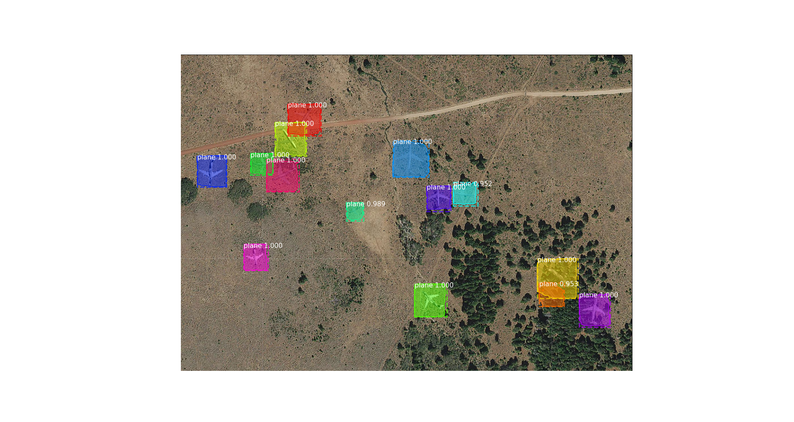

# Airplane detection using Mask R-CNN

The purpose of this project is to demonstrate how to identify airplanes in satellite imagery using Mask R-CNN.

## Requirements
 1. Clone repo: git clone https://github.com/matterport/Mask_RCNN 
 2. Install requirements.txt dependencies of Mask RCNN
  `pip install -r requirements.txt`
 3. Download pre-trained COCO weights (mask_rcnn_coco.h5) from the [release page.](https://www.kaggle.com/aceofspades914/cgi-planes-in-satellite-imagery-w-bboxes) 
 4. Download datasets of airplanes from [kaggle.](https://www.kaggle.com/aceofspades914/cgi-planes-in-satellite-imagery-w-bboxes)
 5. Download pre-trained plane weights from this [link.](https://drive.google.com/file/d/1HN7r7iwwvOQzeqD_a2vSXlu_twUuSjGO/view?usp=sharing)
 
## Test installed set-up

To check the set-up either run sample from Mask R-CNN repository or run test.py provided.
`python test.py`



## Train Mask R-CNN on airplane dataset

To identify airplanes in satellite images we need to train Mask R-CNN on planes dataset downloaded from the kaggle website.

Training of Mask R-CNN starts from the pre-trained COCO weights. This is going to use images and annotations from train and test folders.

`python ./plane.py --model=coco`

To resume training from the last saved weights.

`python ./plane.py --model=last`

## Directory Structure
```bash
├── dataset
│   ├── test
│   └── train
├── evaluate.py
├── images
│   └── sample.png
├── mask_rcnn_coco.h5
├── mask_rcnn_plane.h5
├── mrcnn
│   ├── config.py
│   ├── __init__.py
│   ├── model.py
│   ├── parallel_model.py
│   ├── utils.py
│   └── visualize.py
├── plane.py
├── requirements.txt
└── test.py
```
